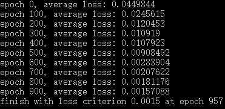
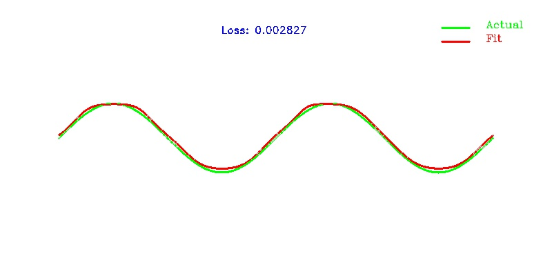

# Simple BP Net :sparkles:
This is a simple 3-layer BP net implemented in C++.

# Example
There is an example to load train data and train BP net to fit the sin function.

## sample net train

## sample train result

# Build
take windows for example, follow cmd commands below and run the vs project generated, where OpenCV_DIR points to the your own opencv installation path.

##
    cd %bpnet_root%
    mkdir build
    cd build
    :: if no opencv change it to: cmake .. -G "Visual Studio 15 2017 Win64
    cmake .. -G "Visual Studio 15 2017 Win64" -DUSE_OPENCV=ON -DOpenCV_DIR=D:\opencv-3.3.0\build

